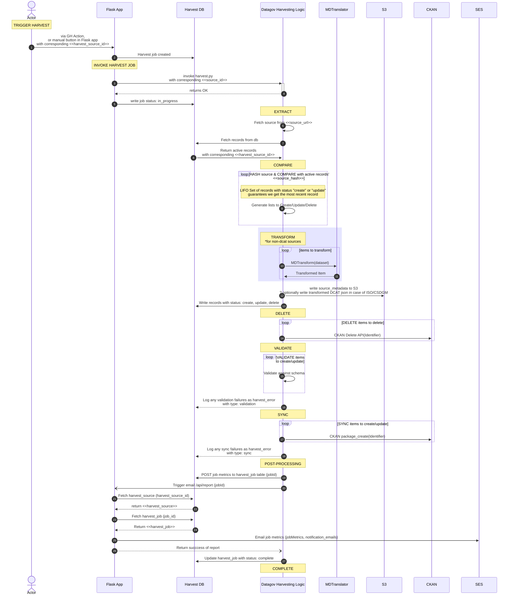

```mermaid
sequenceDiagram
    autonumber
    actor A as Actor
    participant FA as Flask App
    participant HDB as Harvest DB
    participant DHL as Datagov Harvesting Logic
    participant MD as MDTranslator
    participant S3
    participant CKAN
    participant SES
    note over A: TRIGGER HARVEST
    A->>FA: via GH Action,<br>or manual button in Flask app<br>with corresponding <<harvest_source_id>>
    FA->>HDB: Harvest job created
    note over FA: INVOKE HARVEST JOB
    FA->>+DHL: invoke harvest.py<br> with corresponding <<source_id>>
    DHL-->>-FA: returns OK
    FA->>HDB: write job status: in_progress
    note over DHL: EXTRACT
    DHL->>DHL: Fetch source from <<source_url>>
    DHL->>+HDB: Fetch records from db
    HDB->>+DHL: Return active records<br>with corresponding <<harvest_source_id>>
    note over DHL: COMPARE
    loop HASH source & COMPARE with active records' <<source_hash>>
    note over DHL: LIFO Set of records with status "create" or "update"<br>guarantees we get the most recent record
        DHL->>DHL: Generate lists to Create/Update/Delete
    end
    rect rgba(0, 0, 255, .1)
    note over DHL: TRANSFORM<br>*for non-dcat sources
    loop items to transform
        DHL->>MD: MDTransform(dataset)
        MD-->>DHL: Transformed Item
    end
    end
    DHL->>S3: write source_metadata to S3<br>? optionally write transformed DCAT json in case of ISO/CSDGM
    DHL->>HDB: Write records with status: create, update, delete
    note over DHL: DELETE
    loop DELETE items to delete
        DHL->>CKAN: CKAN Delete API(Identifier)
    end
    note over DHL: VALIDATE
    loop VALIDATE items to create/update
        DHL->>DHL: Validate against schema
    end
    DHL-->>HDB: Log any validation failures as harvest_error<br>with type: validation
    note over DHL: SYNC
    loop SYNC items to create/update
        DHL->>CKAN: CKAN package_create(Identifier)
    end
    DHL-->>HDB: Log any sync failures as harvest_error<br>with type: sync
    note over DHL: POST-PROCESSING
    DHL->>HDB: POST job metrics to harvest_job table (jobId)
    DHL-)FA: Trigger email /api/report (jobId)
    FA->>HDB: Fetch harvest_source (harvest_source_id)
    HDB-->>FA: return <<harvest_source>>
    FA->>HDB: Fetch harvest_job (job_id)
    HDB-->>FA: Return <<harvest_job>>
    FA->>SES: Email job metrics (jobMetrics, notification_emails)
    FA--)DHL: Return succcess of report
    DHL->>HDB: Update harvest_job with status: complete
    note over DHL: COMPLETE
```
